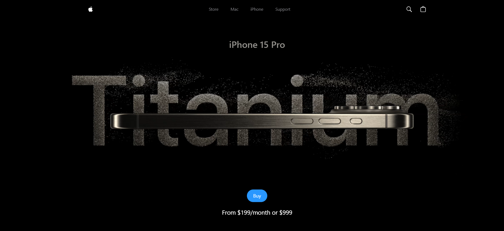

# iPhone 15 Website Clone

A stunning recreation of Apple's iPhone 15 Pro website showcasing advanced 3D modeling and smooth animations.

  
  

## Key Features
- Realistic 3D iPhone models with color variants
- GSAP-powered smooth animations
- Custom video carousel
- Responsive design
- Performance-optimized 3D rendering

## Tech Stack
- React.js
- Three.js (React Three Fiber & Drei)
- GSAP
- Vite
- Tailwind CSS

## Created By
Asad Raza - Creative Developer